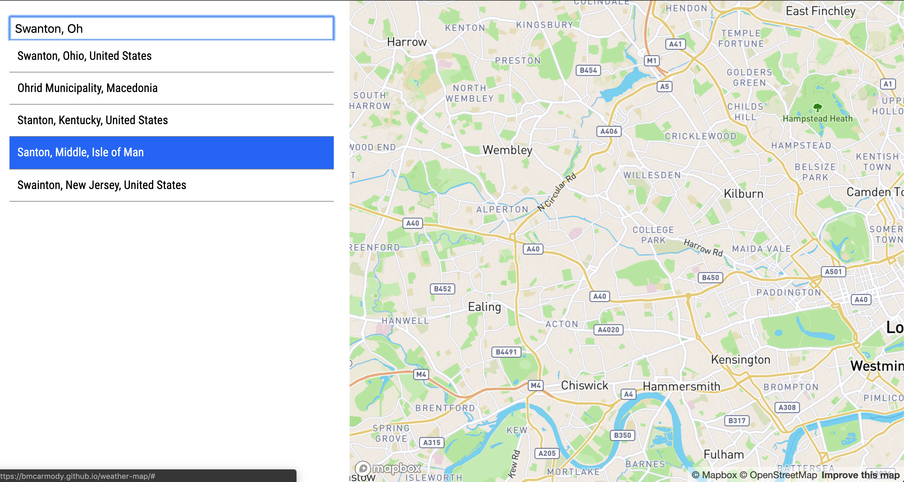
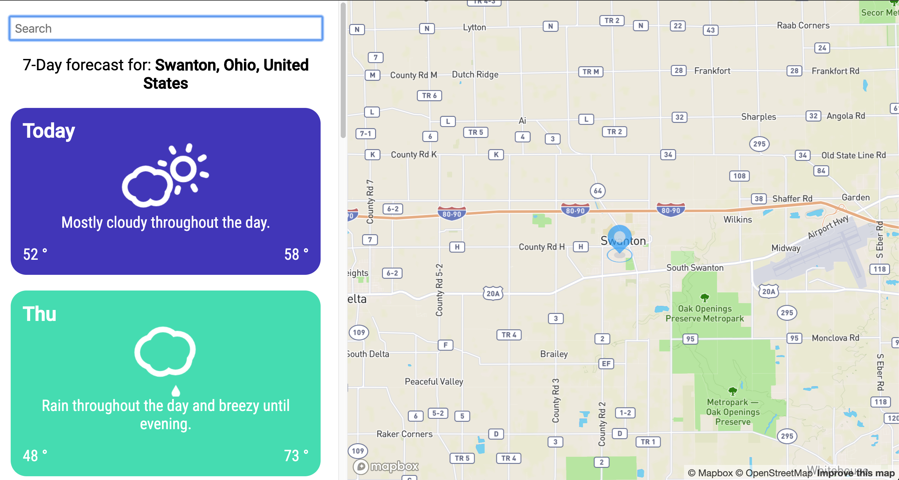

# Weather App

A weather application made with React powered by the Dark Sky and Mapbox API

## Built With

### Front-End

- React
- SCSS

[Atomic Design](http://bradfrost.com/blog/post/atomic-web-design/) component folder structure.

## Functionality
### Search for a City
In the search box, type any city that you'd like to see the 7-day weather forecast of. The textbox has auto completion for all avialable cities.

### See the 7-Day Forecast
Upon search, the map will move to the city you selected. The weather for the selected city will be displayed in weekday format. 

## License
This project is licensed under the MIT License - see the LICENSE.md file for details

